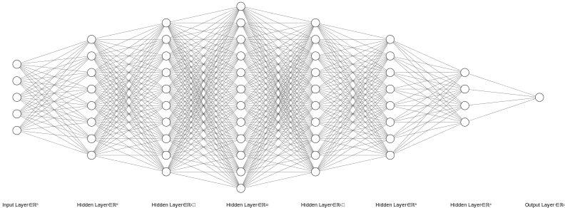

# Usage
## Installation

```zsh
pip install -r requirements.txt
```

## Classification
### Create Model
```python
torchnet = TorchNet()
model = torchnet.create_model(layers=[5, 8, 10, 12, 10, 8, 4, 1])
```
</img>

### Set Data
```python
df = pd.read_csv('torchnet/data/train.csv')
torchnet.set_data(data=df, target='Survived', ignore_features=['PassengerId', 'Name', 'Sex', 'Age', 'Ticket', 'Cabin', 'Embarked'])
```
- target
   - The Value to predict in header
- ignore_features
   - Values to ignore in header

### Train Model
```python
torchnet.train(model, total_epoch=100)
```
